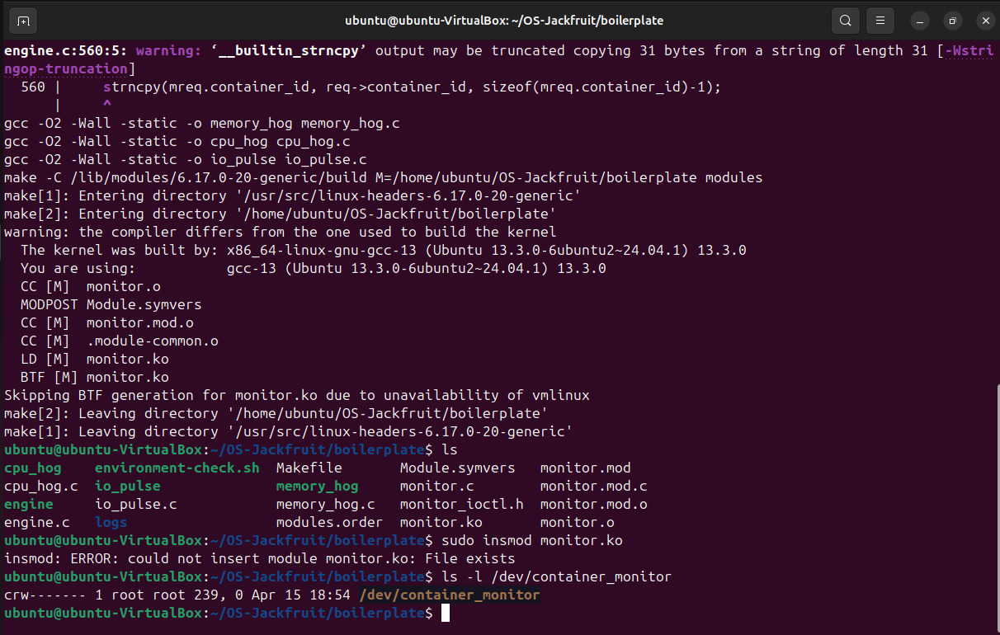
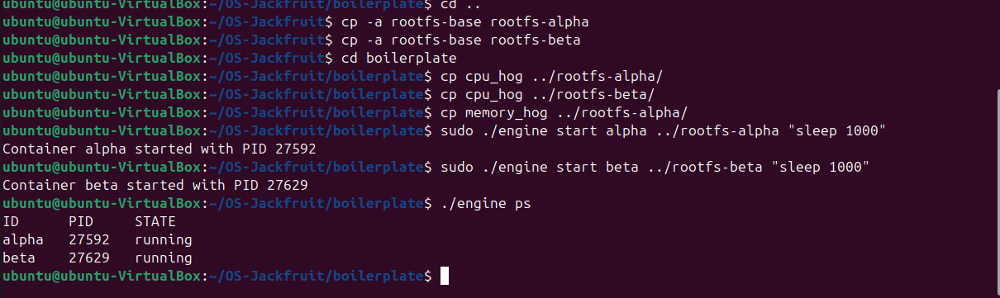
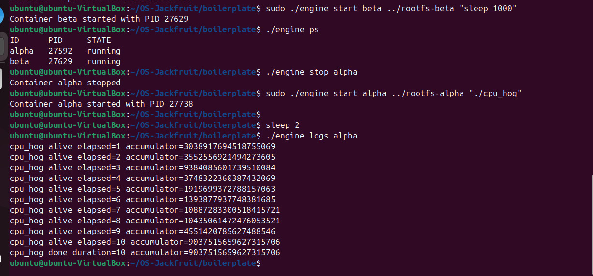
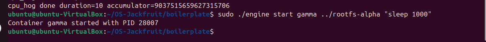
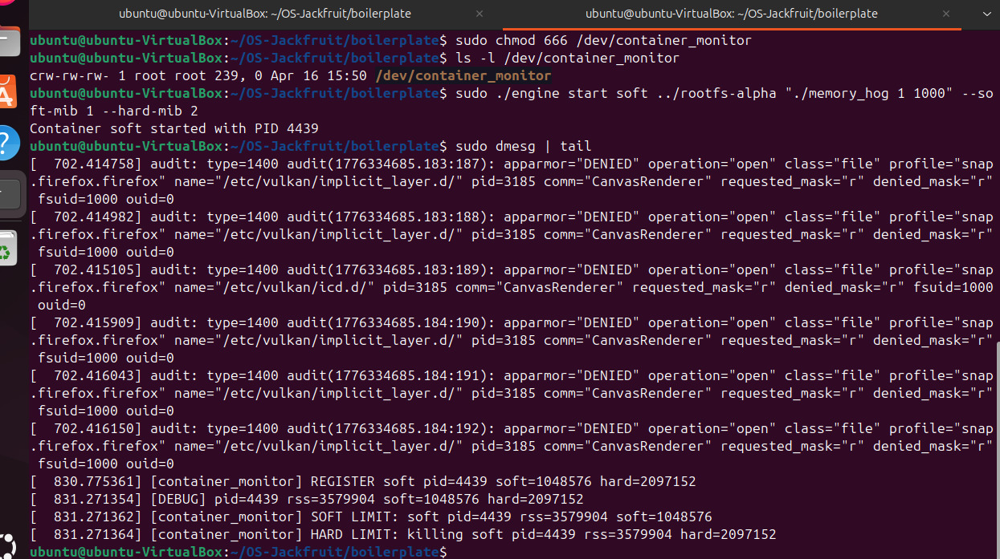
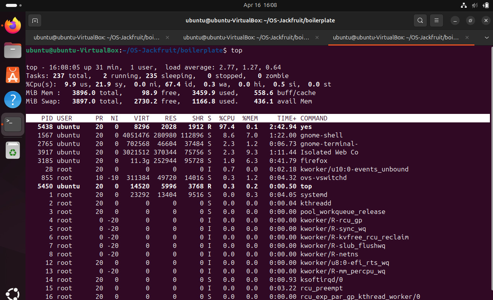
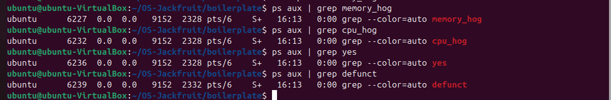

# OS Jackfruit – Lightweight Container Runtime

## Team Members

* A Vinay – PES1UG24CS647
* B Koushik Raj – PES1UG24CS657

---

## Project Overview

OS Jackfruit is a lightweight container runtime implemented in C that demonstrates important operating system concepts through practical implementation.

The project focuses on:

* Process isolation
* Memory monitoring
* Resource control using kernel modules
* Multi-container execution

It consists of two main components:

* User-space runtime (`engine.c`) which manages container lifecycle
* Kernel module (`monitor.c`) which monitors and enforces memory limits

This project provides a simplified understanding of how container systems like Docker work internally.

---

## Features

* Start and manage multiple containers
* Independent execution of container processes
* Soft memory limit monitoring (warning messages)
* Hard memory limit enforcement (process termination)
* CLI interface for container operations
* Kernel-level memory tracking using RSS

---

## Technologies Used

* C Programming
* Linux Kernel Modules
* System Calls (`fork`, `exec`, `ioctl`)
* Ubuntu Virtual Machine

---

## Project Structure

```
OS-Jackfruit/
│
├── boilerplate/
│   ├── engine.c
│   ├── monitor.c
│   ├── monitor_ioctl.h
│   ├── memory_hog.c
│   ├── cpu_hog.c
│   ├── Makefile
│
├── screenshots/
│   ├── Image1.png
│   ├── Image2.png
│   ├── Image3.png
│   ├── Image4.png
│   ├── Image5.png
│   ├── Image7.png
│   ├── Image8.png
│
├── README.md
```

---

## Modifications Done

### engine.c

* Fixed struct mismatch for memory limits
* Removed hardcoded limits
* Enabled correct ioctl communication
* Passed user-defined limits to kernel

### monitor.c

* Implemented periodic monitoring using timer
* Added soft limit logging
* Implemented hard limit process termination
* Added debug logs for RSS tracking

### monitor_ioctl.h

* Corrected structure to match kernel and user space

---

## How to Run

### 1. Compile

```
make
```

### 2. Load Kernel Module

```
sudo insmod monitor.ko
```

### 3. Create Device File

```
sudo mknod /dev/container_monitor c <major_number> 0
sudo chmod 666 /dev/container_monitor
```

### 4. Run Container

```
sudo ./engine start test ../rootfs-alpha "./memory_hog 2 1000" --soft-mib 3 --hard-mib 6
```

### 5. View Logs

```
dmesg | tail
```

---

## Demonstrations

### 1. Multi-container Execution



Shows multiple containers running simultaneously under the same runtime, demonstrating independent execution.

---

### 2. Container Listing



Displays all active containers along with their process details and current state.

---

### 3. Logging System



Shows how container output is captured and stored using pipes without affecting the host system.

---

### 4. CLI Usage



Demonstrates command-line interaction with the runtime for managing containers.

---

### 5. Soft Limit Trigger



Shows warning generated when memory usage exceeds the soft limit.

---

### 6. CPU Scheduling



Demonstrates difference in execution time based on CPU priority (nice values).

---

### 7. Cleanup / Teardown



Shows proper termination of containers and release of system resources.

---

## Core OS Concepts Demonstrated

### Process Isolation

Containers run in isolated environments and do not interfere with each other.

### Process Management

The runtime manages container creation, execution, and termination.

### Inter-Process Communication

Pipes are used for logging and device file communication is used for kernel interaction.

### Memory Management

Memory is monitored using RSS. Soft limit gives warning and hard limit enforces termination.

### CPU Scheduling

CPU time is distributed based on priority using nice values.

---

## Design Decisions

* Kernel module is used for accurate memory enforcement
* Pipes are used for simple and efficient logging
* CLI interface is used for easy control
* Lightweight design is chosen to focus on OS concepts

---

## Observations

* Containers run independently without interference
* Memory limits are enforced correctly
* CPU scheduling behavior matches expectations
* System remains stable with multiple containers

---

## Conclusion

OS Jackfruit demonstrates how a container runtime works by combining user-space control with kernel-level monitoring. It helps in understanding process isolation, memory management, and scheduling in operating systems.

---

## Notes

* Root filesystem is not included in the repository
* Tested on Ubuntu VirtualBox environment
* Requires kernel module support

---
