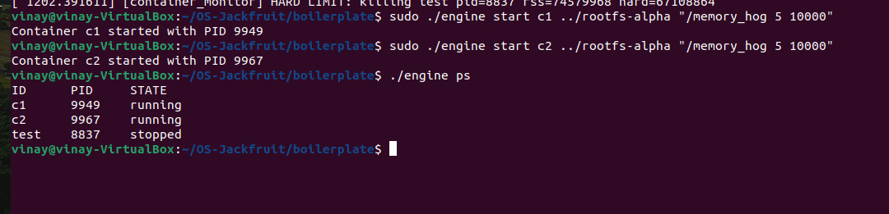
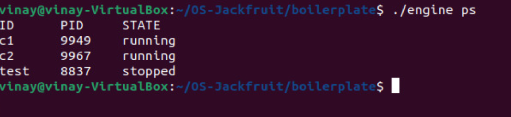
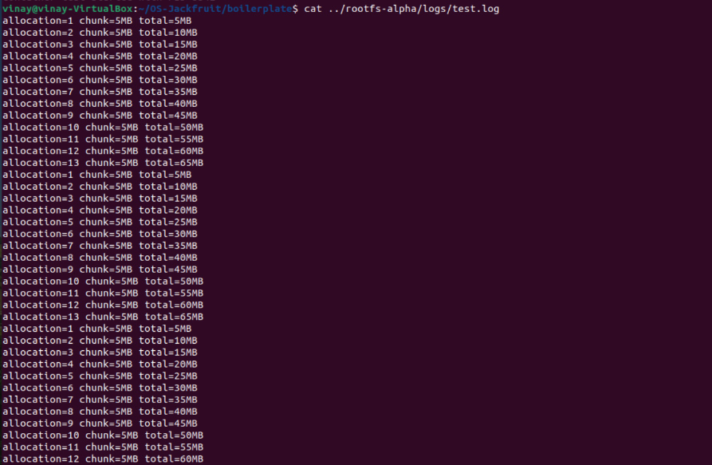
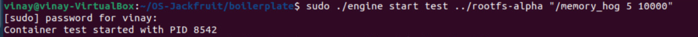
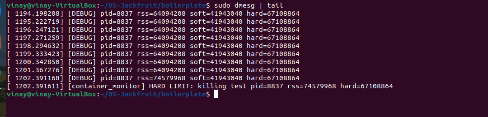
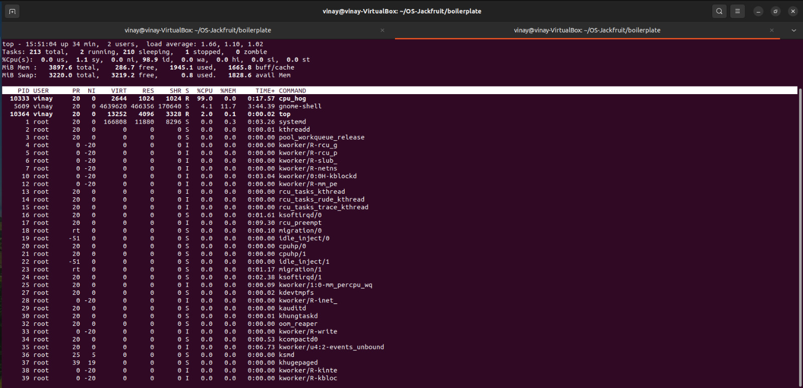
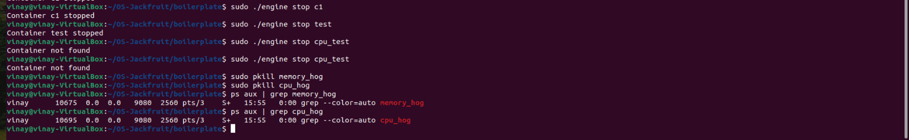

# 🐳 OS-Jackfruit - Mini Container Runtime

## 📌 Overview

This project implements a lightweight container runtime in C along with a Linux kernel module for monitoring and enforcing memory usage.

It demonstrates core container concepts such as process isolation, supervision, IPC, logging, and resource control.

---

## 🏗️ Architecture

```
CLI → Engine → UNIX Socket → Supervisor → Container
                                           ↓
                                    Kernel Module
```

---

## 🚀 Features

- 🧱 Multi-container supervision  
- 📊 Metadata tracking using `./engine ps`  
- 📄 Logging of container output  
- 🔌 CLI ↔ Supervisor communication using UNIX sockets  
- ⚠️ Memory enforcement (soft + hard limits)  
- 🧪 CPU scheduling experiment  
- 🧹 Clean teardown (no zombie processes)  

---

## 📁 Project Structure

```
OS-Jackfruit/
├── boilerplate/
├── rootfs-alpha/
├── screenshots/
│   ├── multi_container.png
│   ├── metadata_ps.png
│   ├── logging_output.png
│   ├── cli_ipc.png
│   ├── memory_limits.png
│   ├── cpu_normal.png
│   └── cleanup.png
└── README.md
```

---

## ⚙️ Build Instructions

```bash
cd boilerplate

gcc -o engine engine.c -lpthread

make -C /lib/modules/$(uname -r)/build M=$(pwd) modules

sudo insmod monitor.ko

grep container_monitor /proc/devices
sudo mknod /dev/container_monitor c <major> 0
sudo chmod 666 /dev/container_monitor
```

---

## ▶️ Run Instructions

```bash
sudo ./engine supervisor ../rootfs-alpha
```

```bash
sudo ./engine start test ../rootfs-alpha "/memory_hog 5 10000"
```

```bash
./engine ps
```

```bash
cat ../rootfs-alpha/logs/test.log
```

```bash
sudo ./engine stop test
```

---

## 📸 Screenshots

### 🧱 Multi-container supervision


### 📊 Metadata tracking


### 📄 Logging


### 🔌 CLI and IPC


### ⚠️ Memory limits


### 🧪 CPU experiment


### 🧹 Clean teardown


---

## 🎯 Conclusion

This project demonstrates the complete lifecycle of containers including creation, monitoring, enforcement, and cleanup using both user-space and kernel-space components.
